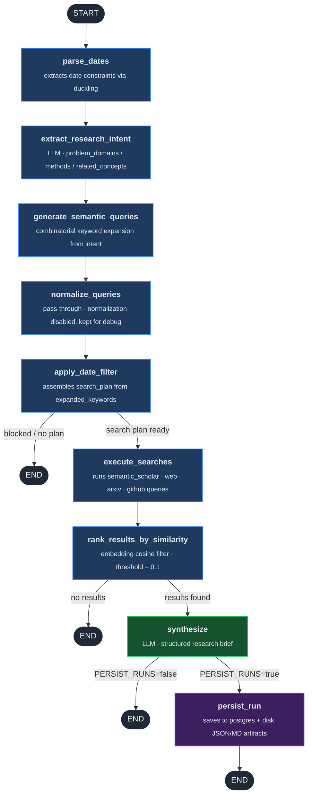

# LangGraph Multi-Agent Research platform

research-agent-platform is a full-stack multi-agent AI platform that runs autonomous research workflows using LangGraph-based agents. The system combines a chat interface, agent orchestration backend, research pipeline, and persistence layer to allow users to run complex queries where agents search, analyze, validate, and synthesize information before producing a final answer.

The platform demonstrates production-style AI infrastructure: a Next.js frontend, Python LangGraph agent backend, FastAPI persistence service, and supporting services (Duckling, PostgreSQL) deployed on Kubernetes with Kustomize overlays. It includes automated Docker builds, secret management via 1Password, and deployment workflows for both local Kubernetes (Docker Desktop) and AWS EKS.

This project showcases practical engineering patterns for multi-agent systems, including self-reflection loops, semantic query generation, search result validation, ranking, and synthesis, along with infrastructure required to run agent-based applications in a containerized environment.

## Architecture

```
Browser → chat-ui (3000)
             ↓
     NGINX Ingress (/api/research → persistence-api, /api → langgraph-api)
             ↓                                    ↓
  langgraph-api (2024)              persistence-api (8001)
       ↓         ↓                         ↓
  duckling    postgres (5432) ←────────────┘
   (8000)
```

### research_agent graph (`agents/research_agent.py`)



> **Disabled node:** `validate_date_range` — post-fetch ISO date range filter; sits between `execute_searches` and `rank_results_by_similarity` (commented out).

### Services

| Service | Port | Description |
|---|---|---|
| chat-ui | 3000 | Next.js 15 frontend |
| langgraph-api | 2024 | LangGraph agent backend (self-reflection, research) |
| persistence-api | 8001 | FastAPI REST API for browsing research runs |
| duckling | 8000 | Rasa Duckling date parser |
| postgres | 5432 | PostgreSQL database |

---

## Local Kubernetes Deployment (Docker Desktop)

### Prerequisites

- [Docker Desktop](https://www.docker.com/products/docker-desktop/) with Kubernetes enabled
- `kubectl` CLI
- `docker` CLI
- `pnpm` (for local frontend development only)

### 1. Enable Kubernetes in Docker Desktop

Docker Desktop → Settings → Kubernetes → Enable Kubernetes → Apply

Verify:
```bash
kubectl config use-context docker-desktop
kubectl get nodes
```

### 2. Configure Secrets (1Password)

Requires the [1Password CLI](https://developer.1password.com/docs/cli/) installed and signed in (`op signin`).

Secrets are injected automatically from 1Password when you run `deploy-local.sh`. To inject manually without a full deploy:

```bash
./scripts/inject-secrets.sh
```

This reads `op://` references from `.env_tpl` and creates/updates the `app-secrets` Kubernetes Secret in memory — nothing is written to disk.

The `.env_tpl` file contains `op://` vault references (e.g. `op://APIS/OPENROUTER_API_KEY_SELF_REFLECT/credential`) — these are safe to commit since they are paths, not real secrets.

**If you don't use 1Password:** manually create the secret instead:
```bash
kubectl create secret generic app-secrets \
  --from-literal=OPENROUTER_API_KEY='your-key' \
  --from-literal=LANGSMITH_API_KEY='your-key' \
  --from-literal=TAVILY_API_KEY='your-key' \
  --from-literal=POSTGRES_PASSWORD='your-password' \
  --dry-run=client -o yaml | kubectl apply -f -
```

### 3. Deploy

```bash
./scripts/deploy-local.sh
```

This builds all Docker images locally, injects secrets from 1Password, and applies the dev Kubernetes overlay.

### 4. Access the App

**Option A — Port-forward (simplest):**
```bash
kubectl port-forward svc/chat-ui 3000:3000 &
```
Open: http://localhost:3000

> **Note:** With port-forward, the browser cannot reach `langgraph-api` via `/api`. For full functionality without Ingress, set `NEXT_PUBLIC_API_URL=http://localhost:2024` in the ConfigMap and also forward the backend:
> ```bash
> kubectl port-forward svc/langgraph-api 2024:2024 &
> ```

### 5. LangSmith Studio (optional)

LangSmith Studio lets you inspect your agent's graph, run it interactively, and debug individual nodes.

**Prerequisite:** Forward the langgraph-api port so Studio can reach it from your browser:
```bash
kubectl port-forward svc/langgraph-api 2024:2024 &
```

Then go to [smith.langchain.com](https://smith.langchain.com) → Studio → configure the connection:
- **Base URL:** `http://localhost:2024`

Studio works regardless of whether `LANGSMITH_TRACING` is enabled.

**Option B — NGINX Ingress:**

Install the NGINX Ingress controller:
```bash
kubectl apply -f https://raw.githubusercontent.com/kubernetes/ingress-nginx/controller-v1.10.0/deploy/static/provider/cloud/deploy.yaml
```

Add to `/etc/hosts`:
```
127.0.0.1 agent.local
```

Open: http://agent.local

### Applying Code Changes

After modifying any service's code, you need to rebuild its Docker image and restart the deployment:

**Option A — Rebuild everything (safest):**
```bash
./scripts/deploy-local.sh
```

**Option B — Rebuild a single service (faster):**
```bash
# 1. Rebuild the image
docker build -t agents/langgraph-api:latest -f infrastructure/docker/langgraph-api.Dockerfile services/langgraph-api/
# (replace langgraph-api with chat-ui or persistence-api as needed)

# 2. Restart the deployment to pick up the new image
kubectl rollout restart deployment/langgraph-api
kubectl rollout status deployment/langgraph-api --timeout=180s
```

Image names and their Dockerfiles:
| Service | Image | Dockerfile |
|---|---|---|
| langgraph-api | `agents/langgraph-api:latest` | `infrastructure/docker/langgraph-api.Dockerfile` |
| chat-ui | `agents/chat-ui:latest` | `infrastructure/docker/chat-ui.Dockerfile` |
| persistence-api | `agents/persistence-api:latest` | `infrastructure/docker/persistence-api.Dockerfile` |

> Kubernetes does **not** watch your source files — it only runs images. A code change has no effect until you rebuild the image and restart the pod.

### Common kubectl Commands

```bash
# View all pods
kubectl get pods

# View logs
kubectl logs deployment/langgraph-api -f

# Restart a deployment
kubectl rollout restart deployment/chat-ui

# Check pod status
kubectl describe pod <pod-name>

# Delete everything
kubectl delete -k infrastructure/k8s/dev
```

---

## Kubernetes Troubleshooting & Operations Manual

This section documents real problems encountered during local Kubernetes setup and how to solve them.

---

### How the cluster works (mental model)

**Docker Desktop provides:**
- A single-node Kubernetes cluster running inside a VM
- Kubernetes is started/stopped from Docker Desktop → Settings → Kubernetes
- The cluster is **not started by `deploy-local.sh`** — you must start it yourself in Docker Desktop first

**`deploy-local.sh` does:**
1. Builds Docker images locally (they live in Docker's image cache, not a registry)
2. Applies Kubernetes manifests (`kubectl apply -k infrastructure/k8s/dev`)
3. Waits for all deployments to be ready

**Kubernetes does NOT:**
- Watch your source files
- Automatically rebuild images when code changes
- Pull images from the internet (dev overlay uses `imagePullPolicy: Never`)

---

### Starting and stopping the cluster

**Start:** Docker Desktop → Settings → Kubernetes → Enable Kubernetes (if not already running)

**Deploy everything from scratch:**
```bash
./scripts/deploy-local.sh
```

**Full reset (nuke everything and redeploy):**
```bash
# Delete all resources
kubectl delete -k infrastructure/k8s/dev

# Rebuild all images from scratch (no Docker cache)
NO_CACHE=1 ./scripts/deploy-local.sh
```

**Why `NO_CACHE=1`?** Docker caches each build layer. If you change `requirements.txt` or other dependencies, Docker will use the cached pip install layer and your changes won't take effect. `NO_CACHE=1` forces a full rebuild from scratch.

---

### Diagnosing pod problems

**Check pod status:**
```bash
kubectl get pods
```

Status meanings:
- `Running` — healthy
- `CrashLoopBackOff` — pod is crashing and Kubernetes keeps restarting it
- `Pending` — waiting for resources (rare on Docker Desktop)
- `ImagePullBackOff` — can't find the Docker image (usually means you haven't built it yet)
- `Error` — crashed once, not yet in loop

**See why a pod crashed (most useful command):**
```bash
# View current logs
kubectl logs deployment/langgraph-api

# Follow logs in real time
kubectl logs deployment/langgraph-api -f

# View logs from a crashed container (previous run)
kubectl logs deployment/langgraph-api --previous
```

**See Kubernetes events for a pod (useful for probe failures, image errors):**
```bash
kubectl describe pod <pod-name>
```
Events are at the bottom. Look for: `Readiness probe failed`, `Back-off restarting failed container`, `Failed to pull image`.

**Get exact pod name:**
```bash
kubectl get pods
# copy the full name, e.g.: langgraph-api-6d8f9b-xkj2p
kubectl describe pod langgraph-api-6d8f9b-xkj2p
```

---

### Common problems and solutions

#### Problem: `CrashLoopBackOff` on langgraph-api

**Symptom:** `kubectl get pods` shows langgraph-api as `CrashLoopBackOff`

**Diagnosis:**
```bash
kubectl logs deployment/langgraph-api --previous
```

**Root cause we hit:** Missing Python dependencies. `research_agent.py` imports `numpy`, `httpx`, `sentence_transformers`, and `tenacity` — but none of these were in `requirements.txt`.

**Error looked like:**
```
ModuleNotFoundError: No module named 'numpy'
```

**Fix:** Add the missing package to `services/langgraph-api/requirements.txt`, then rebuild with `--no-cache` (critical — otherwise Docker reuses the cached pip layer and the fix doesn't take effect):
```bash
NO_CACHE=1 ./scripts/deploy-local.sh
```

**Why `--no-cache` is required for dependency changes:** Docker caches `pip install` as a layer. Without `--no-cache`, the old layer (without the new package) is reused even if `requirements.txt` changed.

---

#### Problem: Deployment stuck on "Waiting for rollout"

**Symptom:**
```
Waiting for deployment "langgraph-api" rollout to finish: 0 of 1 updated replicas are available...
error: deployment "langgraph-api" exceeded its progress deadline
```

**Causes:**
1. Pod is crashing (see CrashLoopBackOff above)
2. Readiness probe is failing (pod starts but health check never passes)

**Diagnosis:**
```bash
kubectl describe pod <pod-name>
# Look at Events section — readiness probe failures will appear there
```

If readiness probes are failing but the pod is running, the app inside may be starting slowly or on the wrong port.

---

#### Problem: `port-forward` keeps dropping connections

**Symptom:** You run `kubectl port-forward svc/chat-ui 3000:3000` and it works for a while, then requests stop working or you get connection refused. The pod is still running.

**Root cause:** `kubectl port-forward` is a development tool, not a production proxy. It creates a direct tunnel over the Kubernetes API server. This tunnel drops under load, after idle periods, or spontaneously.

**Solution:** Use NGINX Ingress instead (see "Setting up NGINX Ingress" below). It's a stable in-cluster reverse proxy that doesn't drop.

---

#### Problem: Redis was added but isn't needed

**Background:** When using the licensed `langchain/langgraph-api:3.12` image, Redis is required as a message queue. After switching to the open-source `langgraph dev` (via `langgraph-cli[inmem]`), Redis is no longer needed.

**Fix:** Remove `redis-deployment.yaml` from `infrastructure/k8s/base/kustomization.yaml` resources list.

---

### Setting up NGINX Ingress (stable local access)

Instead of running `kubectl port-forward` (which drops connections), install the NGINX Ingress controller. This gives you a stable URL at `http://agent.local`.

**Step 1: Install the NGINX Ingress controller**
```bash
kubectl apply -f https://raw.githubusercontent.com/kubernetes/ingress-nginx/controller-v1.10.0/deploy/static/provider/cloud/deploy.yaml
```

**Step 2: Wait for it to be ready**
```bash
kubectl wait --namespace ingress-nginx \
  --for=condition=ready pod \
  --selector=app.kubernetes.io/component=controller \
  --timeout=120s
```

**Step 3: Add `agent.local` to your `/etc/hosts`**
```bash
echo "127.0.0.1 agent.local" | sudo tee -a /etc/hosts
```

> This requires your Mac password because `/etc/hosts` is a system file that requires root access to edit. `sudo` elevates the `tee` command to run as root.

**How `/etc/hosts` works:**
- Your OS checks `/etc/hosts` before querying DNS
- The entry `127.0.0.1 agent.local` means: when any app (browser, curl) tries to connect to `agent.local`, resolve it to `127.0.0.1` (your machine)
- NGINX Ingress controller is listening on port 80 of `127.0.0.1` and routes based on the `Host` header to the right service

**Step 4: Open in browser**
```bash
open http://agent.local
```

**To view or edit `/etc/hosts` later:**
```bash
sudo nano /etc/hosts
# or
cat /etc/hosts
```

---

### langgraph dev vs langchain/langgraph-api (licensed)

| | `langgraph dev` (open-source) | `langchain/langgraph-api:3.12` (licensed) |
|---|---|---|
| Image | Built from our Dockerfile using `langgraph-cli[inmem]` | Pre-built by LangChain |
| Cost | Free | Requires LangSmith Plus or Enterprise |
| Redis | Not needed | Required |
| Use case | Local dev, self-hosted | LangChain Cloud, enterprise |

This project uses `langgraph dev` (open-source). The Dockerfile at `infrastructure/docker/langgraph-api.Dockerfile` builds from `python:3.12-slim` and installs `langgraph-cli[inmem]` via pip.

---

## EKS Deployment

### Prerequisites

1. AWS CLI configured and `kubectl` connected to your EKS cluster.
2. Push to `main` at least once — the CI workflow (`.github/workflows/build-and-push-images.yml`) builds all images and creates ECR repositories automatically. ECR repos are **not** created by `deploy-eks.sh`.
3. Required GitHub secrets: `AWS_ACCESS_KEY_ID`, `AWS_SECRET_ACCESS_KEY`, `AWS_REGION`, `AWS_ACCOUNT_ID`.
4. Note the `IMAGE_TAG` (commit SHA) printed in the workflow job summary.

### Deploy

```bash
aws eks update-kubeconfig --region us-east-1 --name <your-cluster-name>

export AWS_ACCOUNT_ID=123456789012
export AWS_REGION=us-east-1
export IMAGE_TAG=<commit-sha-from-ci-summary>

./scripts/deploy-eks.sh
```

### CI/CD

Push to `main` triggers the build workflow. The workflow job summary shows the exact `IMAGE_TAG` (commit SHA) to use with `deploy-eks.sh`.

---

## Development

### Run tests

```bash
conda run -n agents python -m pytest tests/ -v
```

### Build images manually

```bash
./scripts/build-images.sh
```

### Local frontend development (without Kubernetes)

```bash
cd services/chat-ui
pnpm install
pnpm dev
```

---

## Legacy: Docker Compose

The original Docker Compose setup has been replaced by Kubernetes. If you need to reference the original configuration, see git history prior to the Kubernetes migration commit.
