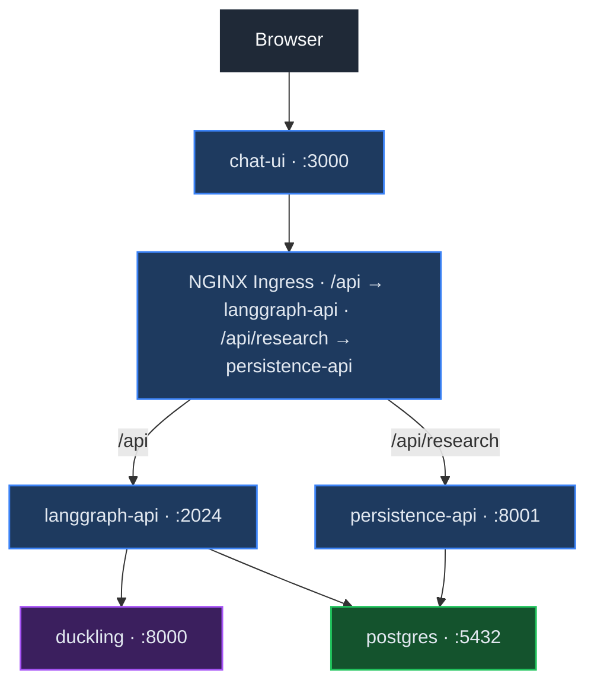
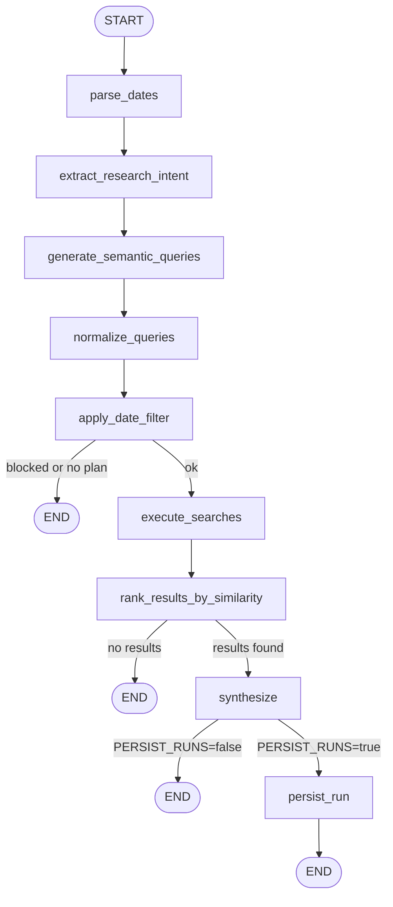
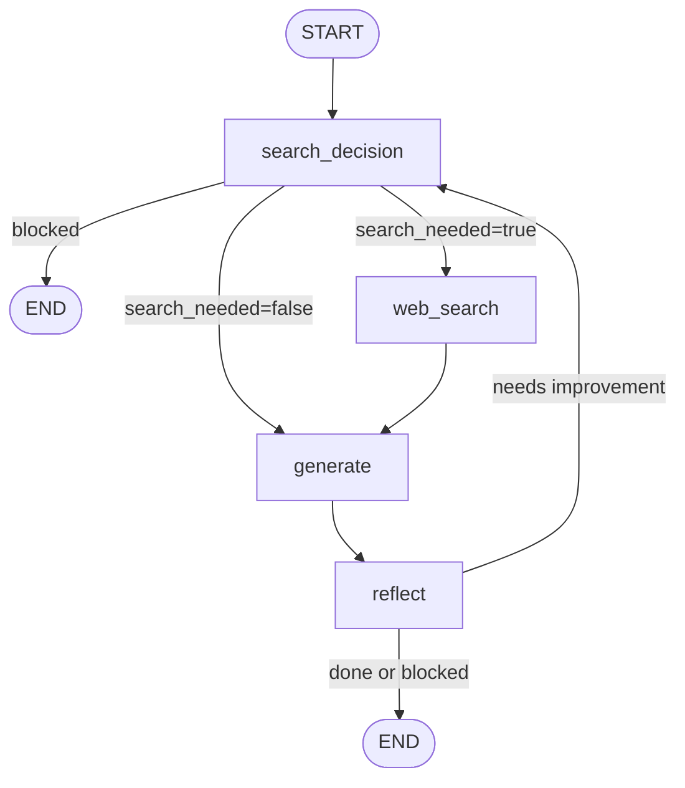
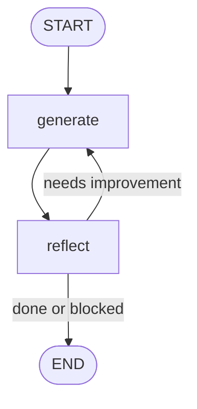

# LangGraph Multi-Agent Research Platform

A full-stack multi-agent AI platform that runs autonomous research workflows using LangGraph-based agents. The system combines a chat interface, agent orchestration backend, research pipeline, and persistence layer to allow users to run complex queries where agents search, analyze, validate, and synthesize information before producing a final answer.

> **Full documentation lives in the [project wiki](wiki/Home.md).** The sections below give you a quick mental model — follow the wiki links to go deeper on any topic.

---

## Architecture



### Services

| Service | Port | Description |
|---|---|---|
| chat-ui | 3000 | Next.js 15 frontend |
| langgraph-api | 2024 | LangGraph agent backend (self-reflection, research) |
| persistence-api | 8001 | FastAPI REST API for browsing research runs |
| duckling | 8000 | Rasa Duckling date parser |
| postgres | 5432 | PostgreSQL database |

---

## Agents

| Agent | Description | Best for |
|---|---|---|
| `research_agent` | 9-node plan-and-execute pipeline: date parsing → intent extraction → semantic query generation → multi-source search → similarity ranking → synthesis | Deep academic/web research with date filtering |
| `self_reflection_agent` | 4-node loop with web search, self-critique, and PII masking | Questions that benefit from iterative refinement and web search |
| `self_reflection_agent_v2` | Simplified 2-node generate→reflect loop, no web search | Fast reasoning tasks without external search |

### research_agent

A 9-node plan-and-execute pipeline that takes a natural language research query, breaks it into structured searches, retrieves academic papers, ranks them by semantic similarity, and synthesizes a research brief. Optionally persists results to PostgreSQL.



### self_reflection_agent (v1)

A 4-node iterative loop that generates answers and improves them through self-critique. Supports optional Tavily web search and includes PII middleware.



### self_reflection_agent_v2

A simplified 2-node version with no web search. Faster and more deterministic. Suitable for reasoning tasks that don't need external data.



For node-by-node internals, state schemas, and loop termination logic → [Manual: Agent Graphs](wiki/Manual-Agent-Graphs.md)

---

## Quick Start

### Docker Compose

```bash
cp .env_tpl .env   # replace op:// references with actual secrets
docker compose up --build
# or, with 1Password CLI:
./run.sh
```

Open http://localhost:3000. → Full setup: [Docker Deployment](wiki/Manual-Deployment-Docker.md)

### Kubernetes (Docker Desktop)

```bash
# 1. Build images
./scripts/build-images.sh

# 2. Inject secrets (requires 1Password CLI, or create manually)
./scripts/inject-secrets.sh

# 3. Deploy
kubectl apply -k infrastructure/k8s/dev
```

Open http://localhost:3000 (after `kubectl port-forward svc/chat-ui 3000:3000`). → Full setup, Helm, and EKS: [Kubernetes Deployment](wiki/Manual-Deployment-Kubernetes.md)

### GKE (Google Kubernetes Engine)

Two cluster modes — choose one before deploying:

**Autopilot** (recommended — no idle node costs, nodes scale to zero):
```bash
gcloud container clusters create-auto agents-cluster --region europe-west1
```

**Standard** (fixed nodes, ~100 GB SSD boot disk per node):
```bash
gcloud container clusters create agents-cluster \
  --region europe-west1 --num-nodes 1 --machine-type e2-standard-2 --disk-size 50
```

```bash
# 1. Build and push images to Artifact Registry
GCP_PROJECT=my-project GCP_REGION=europe-west1 IMAGE_TAG=v1 \
  ./scripts/build-and-push-gke.sh

# 2. Inject secrets (requires 1Password CLI)
GKE_CLUSTER=my-cluster GCP_PROJECT=my-project GCP_REGION=europe-west1 \
  ./scripts/inject-secrets-gke.sh

# 3. Deploy
GCP_PROJECT=my-project GCP_REGION=europe-west1 GKE_CLUSTER=my-cluster IMAGE_TAG=v1 \
  ./scripts/deploy-gke.sh
```

→ Full GKE setup, Artifact Registry, Helm option, and troubleshooting: [GKE Deployment](wiki/Manual-Deployment-GKE.md)

---

## Configuration

Key variables: `OPENROUTER_API_KEY`, `TAVILY_API_KEY`, `POSTGRES_PASSWORD`, `MODEL_NAME` (LLM fallback), `PERSIST_RUNS` (enable DB history), `LANGSMITH_TRACING`.

→ Full reference, per-agent model overrides, and secret management: [Configuration and Secrets](wiki/Manual-Configuration-and-Secrets.md)

---

## Development

### Run tests

```bash
conda run -n agents python -m pytest tests/ -v
```

### Build images manually

```bash
./scripts/build-images.sh
```

### Local frontend development (without Kubernetes)

```bash
cd services/chat-ui
pnpm install
pnpm dev
```

---

## Documentation

The wiki covers everything in depth. Start here if you're onboarding or deploying:

| Page | Description |
|------|-------------|
| [Overview](wiki/Overview.md) | Platform purpose, capabilities, and tech stack |
| [Applications](wiki/Applications.md) | Per-service documentation (ports, deps, env vars) |
| [Manual: Architecture](wiki/Manual-Architecture.md) | Request flow, agent pipeline, Mermaid diagrams |
| [Manual: Agent Graphs](wiki/Manual-Agent-Graphs.md) | LangGraph node-by-node docs for all three agents |
| [Manual: Deployment — Docker](wiki/Manual-Deployment-Docker.md) | Docker Compose setup and startup |
| [Manual: Deployment — Kubernetes](wiki/Manual-Deployment-Kubernetes.md) | K8s local, Helm, and EKS deployment |
| [Manual: Deployment — GKE](wiki/Manual-Deployment-GKE.md) | Google Kubernetes Engine + Artifact Registry |
| [Manual: Configuration and Secrets](wiki/Manual-Configuration-and-Secrets.md) | All env vars, secret management, 1Password flow |
| [Manual: Operations and Troubleshooting](wiki/Manual-Operations-and-Troubleshooting.md) | Day-2 ops, logs, restarts, common failures |
| [Demonstration](wiki/Demonstration.md) | End-to-end demo guide and example prompts |
