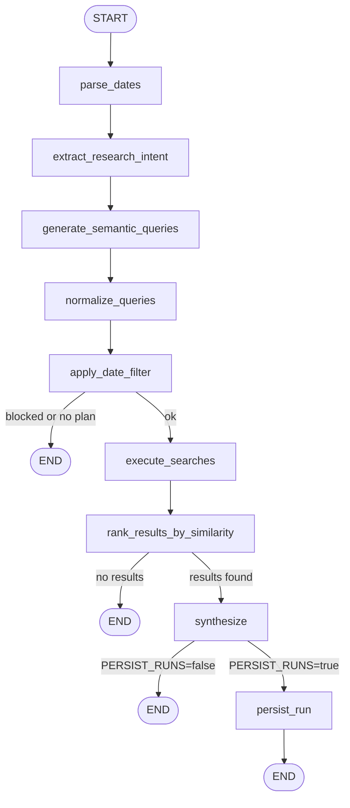
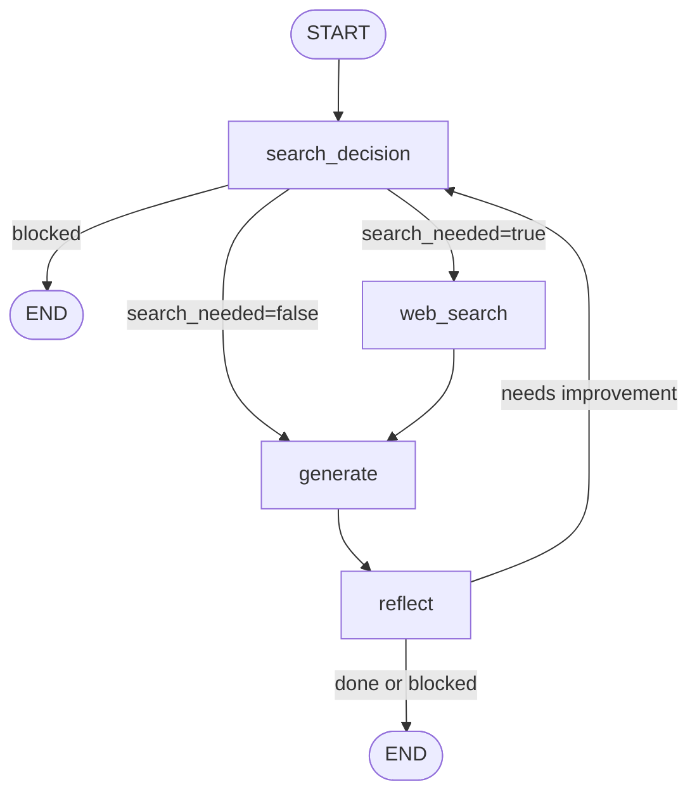
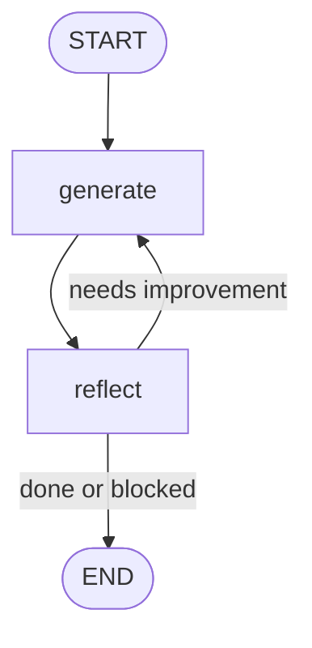

# Manual: Agent Graphs

[← Home](Home) | [Architecture](Manual-Architecture) | [Applications](Applications)

This page documents the three LangGraph agents in `services/langgraph-api/agents/`. For each agent you will find:
- An HTML diagram of the graph
- A Mermaid fallback diagram
- A node-by-node breakdown
- State schema
- Entry/exit conditions
- External dependencies

---

## Table of Contents

1. [research_agent](#1-research_agent)
2. [self_reflection_agent (v1)](#2-self_reflection_agent-v1)
3. [self_reflection_agent_v2](#3-self_reflection_agent_v2)
4. [Graph Semantics](#4-graph-semantics)

---

## 1. research_agent

**File:** `services/langgraph-api/agents/research_agent.py`

**Purpose:** A 9-node plan-and-execute pipeline that takes a natural language research query, breaks it into structured searches, retrieves academic papers, ranks them by semantic similarity, and synthesizes a research brief. Optionally persists results to PostgreSQL.

---

### Graph Diagram

```
START
  │
  ▼
parse_dates
  │
  ▼
extract_research_intent
  │
  ▼
generate_semantic_queries
  │
  ▼
normalize_queries
  │
  ▼
apply_date_filter
  │
  ├─[blocked / no plan]──► END
  │
  └─[ok]──────────────────► execute_searches
                                  │
                                  ▼
                        rank_results_by_similarity
                                  │
                                  ├─[no results]──► END
                                  │
                                  └─[results found]──► synthesize
                                                           │
                                                           ├─[PERSIST_RUNS=false]──► END
                                                           │
                                                           └─[PERSIST_RUNS=true]───► persist_run ──► END
```

---

### research_agent — Mermaid Diagram



---

### State Schema (`ResearchState`)

| Field | Type | Description |
|-------|------|-------------|
| `messages` | `list[BaseMessage]` | Conversation history (inherited from `MessagesState`) |
| `turn` | `int` | Turn counter, used to detect new HumanMessages and reset state |
| `topic` | `str` | Raw user query text |
| `date_filter` | `dict` | `{start_date, end_date}` ISO strings, or `{}` if no dates found |
| `research_intent` | `dict` | `{problem_domains, methods, related_concepts}` |
| `topics` | `list[str]` | Flat list of all phrases from `research_intent` |
| `expanded_keywords` | `list[str]` | Up to 20 deduplicated query strings |
| `arxiv_queries` | `list[str]` | Normalized query strings (currently a pass-through) |
| `search_plan` | `list[dict]` | `[{source, query}, ...]` — tasks for `execute_searches` |
| `search_results` | `list[dict]` | Raw results from all search backends |
| `synthesis` | `str` | Final LLM-written research brief |
| `done` | `bool` | True when synthesis is complete |
| `blocked` | `bool` | True when an error aborted the run |
| `block_reason` | `str` | Human-readable reason for blocking |
| `max_searches` | `int` | Max number of search queries (default: 5) |

---

### Node-by-Node Breakdown

#### `parse_dates`
**Entry point.** Extracts date/time constraints from the latest HumanMessage using Duckling.

- **Input:** `messages` (HumanMessage text)
- **Output:** `date_filter` → `{start_date: "YYYY-MM-DD", end_date: "YYYY-MM-DD"}` or `{}`
- **External dependency:** Duckling HTTP service at `DUCKLING_URL/parse`
- **Failure behavior:** On Duckling timeout or HTTP error, returns `{}` (no date filter). Falls back to regex for year ranges like "2023 to 2025".
- **Why it exists:** Duckling handles complex natural language like "last quarter", "from March to June 2024", "since 2022" more accurately than regex alone.

#### `extract_research_intent`
Parses the user query into structured research intent using an LLM.

- **Input:** `messages` (HumanMessage text), `turn`
- **Output:** `research_intent` (3-key dict), `topics` (flat phrase list), `turn`, plus resets `search_plan`, `search_results`, `synthesis`, `done`, `blocked` on new turns
- **External dependency:** LLM via OpenRouter (`research_topic_extractor_model`)
- **Output shape:**
  ```json
  {
    "problem_domains": ["transformer time series forecasting"],
    "methods": ["attention mechanism", "sequence modeling"],
    "related_concepts": ["temporal dependencies"]
  }
  ```
- **Failure behavior:** On LLM error, falls back to `{"problem_domains": [topic], "methods": [], "related_concepts": []}`.
- **Why it exists:** Converts a free-form query into structured vocabulary for combinatorial query expansion.

#### `generate_semantic_queries`
Generates up to 5 keyword search queries through combinatorial expansion of the research intent.

- **Input:** `research_intent`, `topics`
- **Output:** `expanded_keywords` — list of normalized query strings
- **External dependency:** None (pure Python)
- **Expansion logic:** Bare terms → `domain × method` pairs → `domain × concept` pairs → `domain × method × concept` triples (capped at 6 words). Filler words removed. Deduplication applied.
- **Why it exists:** Maximizes recall by generating diverse queries that cover the search space from multiple angles.

#### `normalize_queries`
Intended to normalize and deduplicate queries — **currently a pass-through** (`return state`). The normalization code exists but is skipped.

- **Input:** `expanded_keywords`
- **Output:** `arxiv_queries` (currently same as `expanded_keywords`)
- **Note:** Code comment says "do not remove it is for debugging". The normalization logic (domain anchoring, stopword removal) is present but bypassed.

#### `apply_date_filter`
Assembles the `search_plan` from `arxiv_queries`. Date filtering is handled inside the individual search backends (not here despite the name).

- **Input:** `arxiv_queries`, `expanded_keywords` (fallback), `topic` (fallback), `max_searches`
- **Output:** `search_plan` — list of `{source: "semantic_scholar", query: "..."}` objects
- **Routing:** If no queries can be generated → sets `blocked=True` → exits early (graph goes to END)
- **Note:** Currently hardcodes `source: "semantic_scholar"`. The `_ALLOWED_SOURCES` constant in the code gates which backends are active (`None` would allow all; current value is `{"semantic_scholar"}`).

#### `execute_searches`
Runs all search tasks in `search_plan` sequentially and collects results.

- **Input:** `search_plan`, `date_filter`
- **Output:** `search_results` — deduplicated list of result dicts
- **External dependencies:**
  - Semantic Scholar API (`https://api.semanticscholar.org/graph/v1/paper/search`)
  - Tavily API (web, if `source: "web"`)
  - GitHub API (if `source: "github"`)
  - arXiv API (if `source: "arxiv"`) — currently disabled by `_ALLOWED_SOURCES`
- **Rate limiting:** Built-in `time.sleep` between arXiv requests (3s) and S2 requests (1s)
- **Failure behavior:** Per-query errors are logged and skipped; the node continues with partial results.
- **Dev shortcut:** Set `USE_MOCK_S2=true` to use hardcoded mock papers (avoids API rate limits).

#### `rank_results_by_similarity`
Filters and re-ranks results by cosine similarity to the original query using a local embedding model.

- **Input:** `topic`, `search_results`
- **Output:** `search_results` (filtered and scored)
- **External dependency:** `sentence-transformers` model (`RESEARCH_EMBEDDING_MODEL`, default: `BAAI/bge-large-en-v1.5`)
- **Threshold:** `SIMILARITY_THRESHOLD = 0.1` (cosine similarity). Results below this are dropped.
- **Routing:** If all results are dropped → sets `synthesis = "No sources found."`, appends `AIMessage` → exits early (END).
- **Why it exists:** Removes topically irrelevant results before synthesis, improving brief quality.

#### `synthesize`
Writes the final structured research brief using an LLM.

- **Input:** `topic`, `search_results`, `date_filter`
- **Output:** `synthesis`, `done=True`, appends `AIMessage` with the brief
- **External dependency:** LLM via OpenRouter (`research_synthesizer_model`)
- **Prompt shape:** Different prompts for date-filtered vs. undated searches. Date-filtered prompts add a "Requested time period" section and instruct the LLM to flag out-of-range results.
- **Output format:** Markdown with `## Summary`, `## Key Findings`, `## Sources` sections.
- **Failure behavior:** On LLM error, sets `synthesis` to the error message plus raw results text.

#### `persist_run`
**Final node (optional).** Saves the completed run to PostgreSQL and disk.

- **Input:** Full `ResearchState`
- **Output:** Returns `state` unchanged (pass-through)
- **Active when:** `PERSIST_RUNS=true` environment variable
- **Writes to PostgreSQL:** `find_or_create_query`, `create_run`, `complete_run`, `persist_sources`
- **Writes to disk:** `data/research/<query_id>/<run_id>/` via `write_disk_artifacts`
- **Failure behavior:** Errors are caught and logged but do not fail the graph (`non-fatal` comment in code).
- **Why it exists:** Allows the persistence-api and UI history panel to retrieve past runs.

---

## 2. self_reflection_agent (v1)

**File:** `services/langgraph-api/agents/self_reflection_agent.py`

**Purpose:** A 4-node iterative loop that generates answers and improves them through self-critique. Supports optional Tavily web search and includes PII middleware.

---

### Graph Diagram

```
START
  │
  ▼
search_decision
  │
  ├─[blocked]────────────────────────────────► END
  │
  ├─[search_needed=true]──► web_search ──┐
  │                                      │
  └─[search_needed=false]────────────────┴──► generate
                                                  │
                                                  ▼
                                               reflect
                                                  │
                                                  ├─[done or blocked]──► END
                                                  │
                                                  └─[needs improvement]──► search_decision (loop)
```

---

### self_reflection_agent v1 — Mermaid Diagram



---

### State Schema (`AgentState`)

| Field | Type | Default | Description |
|-------|------|---------|-------------|
| `messages` | `list` | — | Conversation history |
| `turn` | `int` | 0 | Conversation turn counter |
| `task` | `str` | `""` | Current question/task text |
| `draft` | `str` | `""` | Current answer draft |
| `feedback` | `str` | `""` | Reviewer feedback (empty = approved) |
| `iteration` | `int` | 0 | Generate-reflect loop count |
| `max_iterations` | `int` | 3 | Max loops (1–10) |
| `web_search_count` | `int` | 0 | Number of web searches done |
| `max_web_searches` | `int` | 3 | Max web searches per turn |
| `done` | `bool` | false | True when draft approved or max iterations hit |
| `blocked` | `bool` | false | True when PII or error stopped the agent |
| `block_reason` | `str` | `""` | Why the agent was blocked |
| `web_context` | `str` | `""` | Accumulated web search snippets |
| `search_needed` | `bool` | false | Whether search was decided needed |
| `search_query` | `str` | `""` | Query for the next Tavily search |

---

### Node-by-Node Breakdown

#### `search_decision`
**Entry point.** Decides whether a web search is needed before generating.

- **Input:** `messages`, `task`, `draft`, `feedback`, `web_context`, `iteration`, `web_search_count`
- **Output:** `search_needed`, `search_query`, + resets per-turn fields on new turns
- **New turn detection:** Counts `HumanMessage` instances vs stored `turn`. If count increased, resets `iteration=0`, `web_search_count=0`, `done=False`, `draft=""`, `feedback=""`, `web_context=""`.
- **Search budget:** If `web_search_count >= max_web_searches`, skips search regardless of LLM decision.
- **External dependency:** LLM (`reflection_v1_search_decision_model`) — returns `NEEDS_SEARCH: yes|no` + `QUERY: <text>`
- **Routing output:**
  - `blocked=True` → END
  - `search_needed=True` → `web_search`
  - otherwise → `generate`

#### `web_search`
Executes a Tavily web search and appends results to `web_context`.

- **Input:** `search_needed`, `search_query`, `task`, `web_context`, `web_search_count`
- **Output:** `web_context` (appended), `web_search_count` incremented, `search_needed=False`
- **External dependency:** Tavily API (`TAVILY_API_KEY`)
- **Retry:** 3 attempts with exponential backoff on `ConnectionError`, `TimeoutError`, `OSError`
- **Failure behavior:** On unrecoverable error → `_block_update(source="web_search", ...)` → sets `blocked=True`

#### `generate`
Produces or improves the draft answer.

- **Input:** `task`, `feedback`, `web_context`, `draft`, `iteration`
- **Output:** `draft` (new or improved), `iteration` incremented
- **External dependency:** LangChain agent with PII middleware → LLM (`reflection_v1_generate_model`)
- **PII middleware:** Masks `email`, `credit_card`, `ip`, `mac_address` in both input and output
- **Prompt:** If `feedback` is set → "Return an improved draft addressing feedback". Else → "Write the best possible first draft."
- **Failure behavior:** `PIIDetectionError` → `_block_update(source="generate", ...)`

#### `reflect`
Evaluates the draft and either approves it or provides feedback.

- **Input:** `task`, `draft`, `iteration`, `max_iterations`
- **Output:**
  - If reviewer outputs `APPROVED`: `done=True`, `feedback=""`, appends `AIMessage(content=draft)`
  - If `iteration >= max_iterations`: same as approved (force-terminates)
  - Otherwise: `done=False`, `feedback=<review_text>`
- **External dependency:** LangChain agent with PII middleware → LLM (`reflection_v1_reflect_model`)
- **Routing:** If `done=True` or `blocked=True` → END. Otherwise → `search_decision`.

---

## 3. self_reflection_agent_v2

**File:** `services/langgraph-api/agents/self_reflection_agent_v2.py`

**Purpose:** A simplified 2-node version of v1 with no web search. Faster and more deterministic. Suitable for reasoning tasks that don't need external data.

---

### Graph Diagram

```
START
  │
  ▼
generate
  │
  ▼
reflect
  │
  ├─[done or blocked]──► END
  │
  └─[needs improvement]──► generate (loop)
```

---

### self_reflection_agent v2 — Mermaid Diagram



---

### State Schema (`AgentState` v2)

Same as v1 but without `web_context`, `search_needed`, `search_query`, `web_search_count`, `max_web_searches`.

| Field | Type | Default | Description |
|-------|------|---------|-------------|
| `messages` | `list` | — | Conversation history |
| `turn` | `int` | 0 | Turn counter |
| `task` | `str` | `""` | Task text |
| `draft` | `str` | `""` | Current draft |
| `feedback` | `str` | `""` | Reviewer feedback |
| `iteration` | `int` | 0 | Loop count |
| `max_iterations` | `int` | 3 | Max loops (1–10) |
| `done` | `bool` | false | Completion flag |
| `blocked` | `bool` | false | Safety block flag |
| `block_reason` | `str` | `""` | Block reason |

---

### Node-by-Node Breakdown

#### `generate`
**Entry point.** Generates or improves the draft. Also handles new turn detection (unlike v1 which does this in `search_decision`).

- **Input:** `messages`, `task`, `feedback`, `draft`, `iteration`, `turn`
- **New turn detection:** Same pattern as v1 — resets all per-turn fields when `HumanMessage` count exceeds `turn`.
- **Output:** `draft`, `iteration` incremented, + reset fields if new turn
- **External dependency:** LangChain agent with PII middleware → LLM (`reflection_v2_generate_model`)
- **Failure behavior:** `PIIDetectionError` → `_block_update(...)`

#### `reflect`
Evaluates draft quality and routes the graph.

- **Input:** `task`, `draft`, `iteration`, `max_iterations`
- **Output:**
  - `APPROVED` or `iteration >= max_iterations` → `done=True`, appends `AIMessage(content=draft)`
  - Otherwise → `done=False`, `feedback=<review_text>`
- **External dependency:** LangChain agent with PII middleware → LLM (`reflection_v2_reflect_model`)
- **Routing:** `done=True` or `blocked=True` → END. Otherwise → `generate`.

---

## 4. Graph Semantics

### How State Moves Through LangGraph

LangGraph executes agents as a `StateGraph`. State is a `TypedDict` (or `MessagesState` subclass) shared across all nodes.

**Node contract:**
- Receives full current state as a plain dict
- Returns a **partial** dict with only the keys it changed
- LangGraph merges the partial update into state before routing

**Message accumulation:** `messages` uses the `add_messages` reducer (inherited from `MessagesState`). Nodes append to `messages` by returning `{"messages": [new_msg]}` — they do not replace the list.

**Conditional edges:** Routing functions inspect state after a node completes and return a string key (`"next_node"` or `"__end__"`). The edge map translates string keys to node names or `END`.

### Where Loops Happen

| Agent | Loop condition | Max iterations |
|-------|---------------|----------------|
| research_agent | None — linear pipeline | N/A |
| self_reflection_agent (v1) | `reflect` → `search_decision` when `done=False` and not blocked | `max_iterations` (default 3) |
| self_reflection_agent_v2 | `reflect` → `generate` when `done=False` and not blocked | `max_iterations` (default 3) |

**Loop termination conditions:**
1. Reviewer outputs exactly `APPROVED`
2. `iteration >= max_iterations` (force-terminate, still outputs draft)
3. `blocked=True` (PII or unrecoverable error)

### Multi-turn Conversations

All three agents support multi-turn conversations. Turn detection works by counting `HumanMessage` instances in the `messages` list:

```python
human_msg_count = sum(1 for m in messages if isinstance(m, HumanMessage))
if human_msg_count > current_turn:
    # New external turn — reset all per-turn counters
```

This allows the same graph instance to handle subsequent questions without contaminating state from prior turns.

### Persistence and Checkpointing

The deployment uses the **in-memory LangGraph checkpointer** (LangGraph CLI open-source mode). This means:
- Active conversation threads survive within a process
- Process restart clears all thread state
- There is no external Redis, PostgreSQL, or other checkpoint store for graph state
- Research run *outputs* are persisted to PostgreSQL via the `persist_run` node — but this is application-level persistence, separate from graph checkpoints

### How Graph Design Maps to Product Behavior

| Graph behavior | Product outcome |
|----------------|----------------|
| `parse_dates` runs first | Users can write natural language like "from last year" and get accurate date filtering |
| `research_agent` is linear | Predictable, observable pipeline — easy to trace in LangSmith |
| Self-reflection loop | Each answer improves through critique — visible in turn-by-turn output streaming |
| `blocked=True` early exit | PII-containing inputs are rejected safely without exposing data |
| `PERSIST_RUNS` flag | Operators can toggle history storage without changing agent logic |
| `normalize_queries` pass-through | Current behavior: keyword expansion feeds directly into search plan (normalization is a future refinement) |

---

## See Also

- [Architecture](Manual-Architecture) — System-level request flow
- [Applications](Applications) — Service overview with ports and dependencies
- [Configuration and Secrets](Manual-Configuration-and-Secrets) — Per-node model configuration
