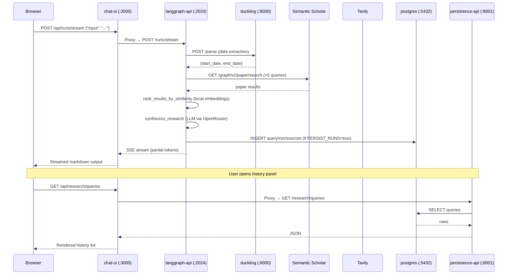

# Manual: Architecture

[← Home](Home.md) | [Applications](Applications.md) | [Agent Graphs](Manual-Agent-Graphs.md)

---

## Component Overview

The platform is composed of five services that communicate over HTTP:

```
┌─────────────────────────────────────────────────────┐
│                    Browser                          │
└─────────────────────┬───────────────────────────────┘
                      │ HTTP
┌─────────────────────▼───────────────────────────────┐
│               chat-ui (:3000)                       │
│         Next.js 15 App Router                       │
│  /api/* → langgraph-api (proxy)                     │
│  /api/research/* → persistence-api (proxy)          │
└─────┬───────────────────────────┬───────────────────┘
      │ LangGraph streaming       │ REST (history)
      ▼                           ▼
┌──────────────┐        ┌──────────────────┐
│langgraph-api │        │ persistence-api  │
│   (:2024)    │        │    (:8001)       │
│  LangGraph   │        │    FastAPI       │
│  3 agents    │        │                 │
└──────┬───────┘        └───────┬──────────┘
       │                        │
       │ HTTP (date parse)       │ SQL
       ▼                        ▼
┌────────────┐          ┌──────────────┐
│  duckling  │          │  postgres    │
│   (:8000)  │          │   (:5432)    │
│ Date parser│          │ Research DB  │
└────────────┘          └──────────────┘

+ External APIs (from langgraph-api):
  - Semantic Scholar  https://api.semanticscholar.org
  - Tavily            https://api.tavily.com
  - GitHub            https://api.github.com
  - OpenRouter        https://openrouter.ai/api/v1  (LLM gateway)
  - LangSmith         https://smith.langchain.com   (optional tracing)
```

---

## Request Flow — Research Query



---

## Ingress and Routing

### Kubernetes (Ingress)

When the NGINX Ingress controller is active (`agent.local`):

| Path | Destination | Notes |
|------|------------|-------|
| `/api/research/*` | `persistence-api:8001` | Rewrite strips `/api` prefix |
| `/api/*` | `langgraph-api:2024` | Rewrite strips `/api` prefix |
| `/*` | `chat-ui:3000` | Serves the Next.js frontend |

The `persistence-api` rule is listed **first** in `ingress.yaml` to ensure it takes priority over the catch-all `/api/*` rule.

### Docker Compose / Next.js proxy

In Docker Compose mode the Next.js `next.config.js` rewrites:
- `/api/research/*` → `http://research-persistence-api:8001/*`
- `/api/*` → `http://agent:2024/*`

This avoids CORS and lets the browser always talk to a single origin (`:3000`).

---

## Data Flow — Persistence Layer

When `PERSIST_RUNS=true`, the `persist_run` node (last in the research graph) writes:

```
ResearchState
  ├── topic          → Query.text
  ├── synthesis      → Run.synthesis_text
  ├── date_filter    → Run.date_filter (JSON)
  └── search_results → Source rows (title, url, snippet, source_type)
```

Disk artifacts are also written to `data/research/<query_id>/<run_id>/` inside the langgraph-api pod (mounted from the host via the `data/` volume).

---

## LangGraph Workflow

LangGraph runs agents as directed graphs of Python functions (nodes). Each node receives the full state dict and returns a partial dict of updates. LangGraph merges the update back into state before routing to the next node.

**How state flows:**
1. Entry point receives initial `HumanMessage` in `messages`
2. Each node reads from state, does work, writes back to state
3. Conditional edges inspect state fields to decide next node
4. Terminal nodes (or `done=True`) route to `END`

**Checkpointing:** This deployment uses the in-memory checkpointer (LangGraph CLI open-source mode). Conversation threads are persisted only within a process lifetime — there is no external Redis or database checkpoint store. A process restart clears all active threads.

For the full per-node breakdown of each agent, see [Manual: Agent Graphs](Manual-Agent-Graphs.md).

---

## Configuration and Environment Boundaries

| Boundary | What crosses it | How |
|----------|----------------|-----|
| Browser ↔ chat-ui | NEXT_PUBLIC_API_URL (injected at build time) | Next.js env |
| chat-ui ↔ langgraph-api | LANGGRAPH_API_URL (server-side proxy) | Next.js rewrites |
| chat-ui ↔ persistence-api | RESEARCH_PERSISTENCE_API_URL (server-side proxy) | Next.js rewrites |
| langgraph-api ↔ LLM | OPENROUTER_API_KEY, OPENROUTER_BASE_URL | env vars |
| langgraph-api ↔ Duckling | DUCKLING_URL | env var |
| langgraph-api ↔ Postgres | DATABASE_URL | env var |
| All secrets | Stored in K8s secret `app-secrets` | Injected from 1Password |

---

## Environment-Specific Notes

### Local Kubernetes (Docker Desktop)
- Image pull policy: `Never` (uses locally built images)
- Ingress: optional, requires `nginx` ingress controller installed separately
- Secrets: injected by `scripts/inject-secrets.sh` from 1Password

### EKS (Production)
- Images pulled from ECR (tagged with git commit SHA)
- Ingress: AWS load balancer or nginx ingress
- Secrets: same K8s secret `app-secrets` mechanism, injected by CI/CD

### Docker Compose (Legacy)
- All services on a single Docker network
- Service names resolve as hostnames (`agent`, `postgres`, `duckling`, `research-persistence-api`)
- `run.sh` wraps startup with `op run` for 1Password injection

---

## See Also

- [Applications](Applications.md) — Per-service details
- [Manual: Agent Graphs](Manual-Agent-Graphs.md) — LangGraph node-by-node docs
- [Manual: Configuration and Secrets](Manual-Configuration-and-Secrets.md) — All env vars
